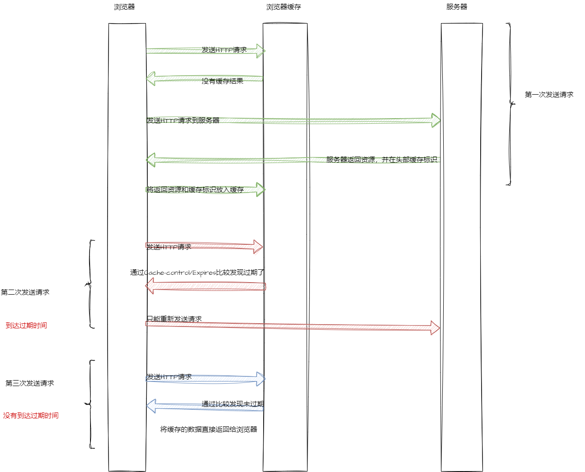
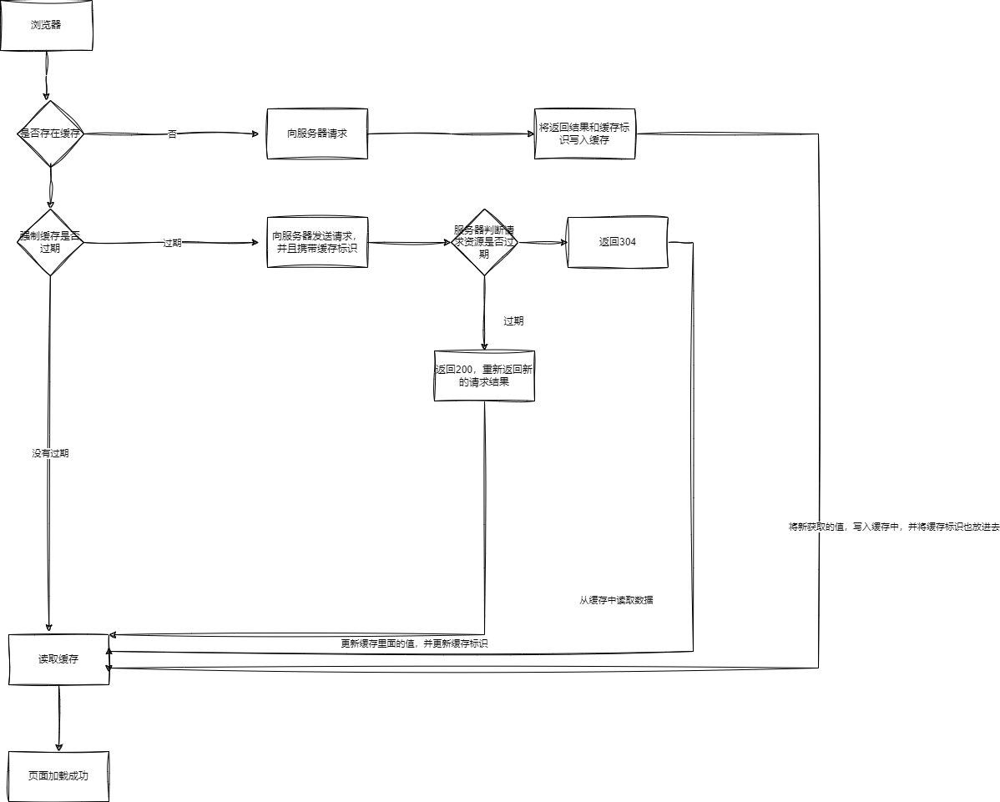

## 什么是浏览器的缓存机制

浏览器缓存机制又可以称为是`Http`缓存机制`，是指浏览器对于静态资源的缓存策略。
对于一些**重复性**的请求，浏览器会将请求的资源缓存起来，当下次请求时，如果资源没有发生变化，就会直接从缓存中获取，而不是再次向服务器发起请求。

实现`HTTP`缓存的方式有很多，但是大体上可以分为两种：

- 强制缓存
- 协商缓存

## 强制缓存

浏览器在第一次请求资源时，服务器会将资源的缓存策略一起返回给浏览器，**浏览器会根据缓存策略来决定是否缓存资源**。**由浏览器来决定，是不是使用缓存**，而不是由服务器来决定。

强制缓存主要使用的是响应头中的两个字段：`Expires`和`Cache-Control`。

- `Expires`：是一个绝对时间，用来指定资源的过期时间，即到了这个时间，浏览器就会向服务器发起请求，如果没有发生变化，就会使用缓存。
  **但是到了`HTTP1.1`以后，`Expires`就被`Cache-COntrol`替换了**，这是因为，`Expires`是一个绝对时间，是由服务器来设置的，如果服务器的时间和浏览器的时间不一致，就会导致缓存失效，但是浏览器第二次请求时，服务器的时间和浏览器的时间可能就一致了，这样就会导致缓存生效，但是实际上，资源已经发生了变化，这样就会导致缓存失效。
- `Cache-Control`：是一个相对时间，用来指定资源的过期时间，即到了这个时间，浏览器就会向服务器发起请求，如果没有发生变化，就会使用缓存。
  `Cache-Control`的值有很多，常用的有以下几个：
  - `no-cache`：不使用强制缓存，但是会使用**协商缓存**。
  - `no-store`：不使用强制缓存，也不使用协商缓存。
  - `max-age`：指定资源的过期时间，单位是秒，缓存内容将在这个时间之后失效。
  - `s-maxage`：和`max-age`的作用一样，但是只针对于代理服务器，比如`CDN`。

**`Cache-Control`的优先级要高于`Expires`**

引申：浏览器缓存，那么将请求的资源缓存到哪里呢？
浏览器缓存主要分为两种：**内存缓存**和**硬盘缓存**

- 内存缓存的优点是读取速度快，但是缺点是存储空间小，而且会随着浏览器(进程)的关闭而释放。
- 硬盘缓存的优点是存储空间大，而且不会随着浏览器的关闭而释放，但是缺点是读取速度慢。

  **浏览器会将`js`和图片解析完成后将他们放在内存缓存中，将`css`文件会存放在硬盘中**

  <!-- 插入图片，浏览器强制缓存 -->

  

## 协商缓存

协商缓存是指，当强制缓存失效以后，浏览器会携带**缓存标识**向服务器发起请求，由服务器根据**缓存标识**来决定是否使用缓存。

控制协商缓存的字段有两组：

- `Last-Modified`和`If-Modified-Since`：表示的是时间，最后一次修改时间。
- `ETag`和`If-None-Match`：表示的是资源的唯一标识，是一个字符串。
  **其中，`Etag`的优先级会高一点**

具体流程如下：

- 当强制缓存失效后，浏览器再次发送请求到服务器，并且会在请求头里面携带`If-Modified-Since`或者`If-None-Match`字段，这两个字段的值分别是上一次请求返回的`Last-Modified`和`ETag`的值。
- 服务器接受到请求后，会根据`If-Modified-Since`或者`If-None-Match`的值和资源的最新修改时间或者`ETag`的值进行对比，如果没有发生变化，就会返回`304`，并且不会返回资源内容，浏览器就会使用缓存，如果发生了变化，就会返回`200`，并且返回资源内容，浏览器就会使用最新的资源。

## 总结

强制缓存优先于协商缓存进行，若强制缓存(Expires 和 Cache-Control)生效则直接使用缓存，若不生效则进行协商缓存(`Last-Modified` / `If-Modified-Since`和`ETag` / `If-None-Match`)，**协商缓存由服务器决定是否使用缓存**，若协商缓存失效，那么代表该请求的缓存失效，重新获取请求结果，再存入浏览器缓存中；生效则返回 304，继续使用缓存。

<!-- 插入图片 -->

