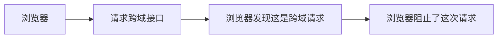
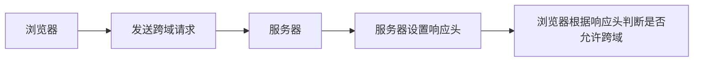
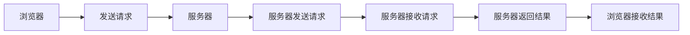

## 什么是跨域

跨域是指**浏览器**不能执行其他网站的脚本。它是由**浏览器的同源策略**造成的，是浏览器对`javascript`施加的安全限制。

引申： 什么是同源策略？

### 同源策略

浏览器规定，`AJAX`请求只能发给同源的网址，否则就报错。所谓同源是指，域名，协议，端口相同。

例如：

```bash
http://www.example.com/dir/page.html

http://www.example.com/dir2/other.html # 同源

https://www.example.com/dir/page.html # 不同源（协议不同）

http://www.example.com:81/dir/page.html # 不同源（端口不同）

http://www.example.com/dir/page.html # 不同源（域名不同）
```

比如你在请求一个跨域的接口，浏览器会将这个请求拦截下来，不会发出去，也不会返回结果，但是浏览器的控制台中会显示出如下错误信息：



## 如何解决跨域

### 1. 通过 jsonp 跨域

`jsonp`的原理是动态创建`script`标签

**HTML5 的 script 标签，默认 type 就是 text/javascript**,这时候请求的内容就会被当做`javascript`代码去执行，然后就可以拿到数据。

```javascript
<script>
    var script = document.createElement('script');
    script.type = 'text/javascript';

    // 传参并指定回调执行函数为onBack
    script.src = 'http://www.domain2.com:8080/login?user=admin&callback=onBack';
    document.head.appendChild(script);

    // 回调执行函数
    function onBack(res) {
        alert(JSON.stringify(res));
    }
</script>
```

也就是说，我们在客户端提前设置好一个函数，这个函数的作用是拿到服务器返回的数据，然后做一些事情，这个函数就是`onBack`。
当服务器看到这些额外的参数，就会将要返回的数据包裹在这个函数里面，然后以 JSON 格式返回给客户端。

JOSNP 的优缺点：

- 优点：兼容性好，简单易用，支持浏览器与服务器双向通信。
- 缺点：只支持 GET 请求，不安全，可能会遭受 XSS 攻击。

### 2. CORS 跨域

1. 当浏览器在发送跨域请求的时候，会自动在请求头中加入`Origin`字段，这个字段的值就是当前页面的源（协议 + 域名 + 端口）。
2. 这时候服务器就可以根据这个值来决定是否同意这次请求。可以设置`Access-Control-Allow-Origin`字段来允许指定源的请求。
3. **当用户想要修改服务器数据的时候，例如 PUT，Patch 之类的**，浏览器就会自动发送一个预检请求，这个请求是一个`OPTIONS`请求，这个请求的作用是询问服务器是否允许这种请求，如果服务器允许，就会在响应头中加入`Access-Control-Allow-Methods`字段，告诉浏览器允许这种请求。

```javascript
// nodejs
const http = require('http');
const server = http.createServer();

server.on('request', (req, res) => {
    // 设置响应头，允许跨域
    res.setHeader('Access-Control-Allow-Origin', '*');
    // 设置响应头，允许跨域的请求方式
    res.setHeader('Access-Control-Allow-Methods', 'GET,POST,DELETE,OPTIONS');
    // 允许前端获取哪个请求头
    res.setHeader('Access-Control-Allow-Headers', 'x-requested-with,content-type');
    // 设置响应头，允许跨域携带cookie
    res.setHeader('Access-Control-Allow-Credentials', true);

    // 设置响应体
    res.end('hello cors');
});

server.listen(3000, () => {
    console.log('server running at http://
    localhost:3000');
});

```

具体流程如下：



### 3. 反向代理

反向代理的原理是：同源策略是浏览器的安全策略，不是服务器的安全策略，服务器完全可以不遵守同源策略，服务器可以接收任何请求，也可以发送任何请求，所以我们可以通过服务器来请求接口，然后再将结果返回给浏览器，这样浏览器就认为这是同源的了。



一般在项目中，我们可以去配置`nginx`来做反向代理，也可以配置`Vite`, `webpack`等工具来做反向代理。
