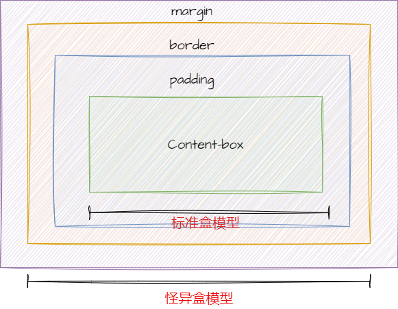

## 盒模型

盒模型是一个矩形的盒子，它包含了元素的内容、内边距、边框和外边距。

css 中盒模型分为两种：标准盒模型和 IE 盒模型。

- 标准盒模型：`width` = `content`
- IE 盒模型：`width` = `content` + `padding` + `border`

在`CSS`中通过`box-sizing`来进行设置

```css
    box-sizing: content-box; /* 标准盒模型 */
    box-sizing: border-box; /* IE盒模型 */
```

### 标准盒模型

标准盒模型其实就是`width`就是内容的宽度，不包含`padding`和`border`。

- `width` = `content`
- `height` = `content`

盒子实际宽高：

- 盒子的总宽度是`width` + `padding` + `border`+`margin`。
- 盒子的总高度是`height` + `padding` + `border`+`margin`。

### 怪异盒模型

你设置多大的`width`和`height`，盒子就是多大，不管你有没有设置`padding`和`border`。

- `width` = `content` + `padding` + `border`
- `height` = `content` + `padding` + `border`

盒子的总宽度是`width`+`margin`。
盒子的总高度是`height`+`margin`。

<!-- 插入图片 -->


