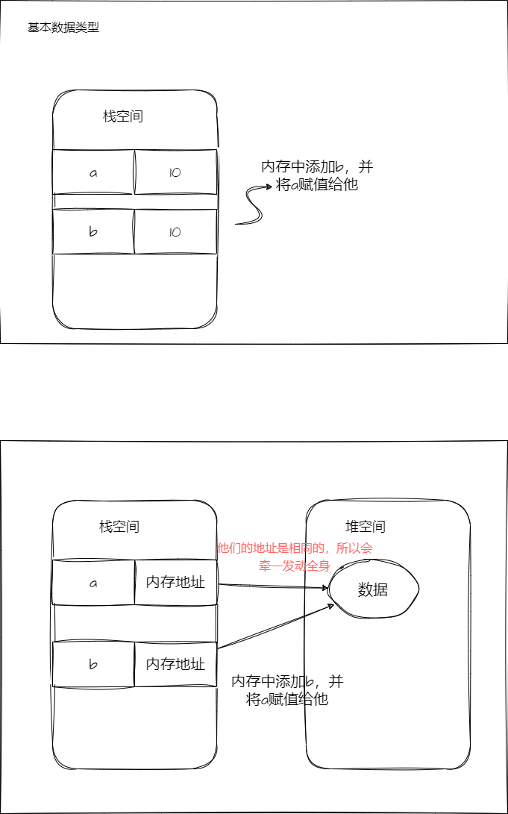

### 基本数据类型

#### `Number`

转化为数字的方法`parseInt()`和`Number()` 有什么区别？

- `Number()`只可以转化**纯数字字符串或者空字符串**，**长度为 1/0 的数组**，**布尔值**，**null**
- `ParseInt()`只能将字符串转化为数字，遇到不可以转化的就截断，返回已经转化的数字，如果第一个字符就不可以转化，返回`NaN`

<!-- 绘制7x3的表格 -->

|   value    | Number() | parseInt() |
| :--------: | :------: | :--------: |
|   '123'    |   123    |    123     |
|   '123a'   |   NaN    |    123     |
|   'a123'   |   NaN    |    NaN     |
| true/false |   1/0    |    NaN     |
|    null    |    0     |    NaN     |
|  [] / [1]  |   0/1    |    NaN     |
|     ""     |    0     |    NaN     |

#### `String`

#### `Boolean`

转化为布尔值的方法：`Boolean()`和`!!`

- `Boolean()`
- `!!`:双重非运算符

布尔值转化为`false`的情况：

- `0`(数字 0)
- `null`
- `undefined`
- `NaN`
- `''`(空字符串)  
  **其他情况都是转化为`true`**，比如`[]`,`{}`等

#### `Null`

`typeof null`会返回`object`

#### `Undefined`

`undefined`是一个全局变量，它的值就是`undefined`，一般`typeof undefined`会返回`undefined`,它其实就是变量声明，但是没有赋值的情况下的默认值

`undefined`和`null`的区别：

- `undefined`是一个变量，而`null`是一个关键字
- `undefined`是变量声明，但是没有赋值的情况下的默认值，而`null`是一个空对象指针(`Object`)
- `undefined`的类型是`undefined`，而`null`的类型是`object`
- `undefined`转化为数字是`NaN`，而`null`转化为数字是`0`
- `null == undefined` // true

#### `Symbol`

### 引用数据类型

#### `Object`

#### `Array`

#### `Function`

#### `Date`

#### `RegExp`

### 存储位置

- 基本数据类型的值是存储在**栈内存**中的，每个变量都有自己的内存空间，互不影响

- 引用数据类型的值是存储在**堆内存**中的，每个变量存储的是一个指针，指向存储在堆内存中的对象，这个对象包含了实际的值

<!-- 插入图片 -->

