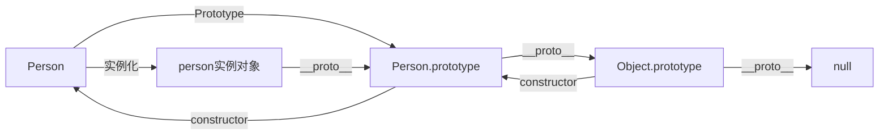
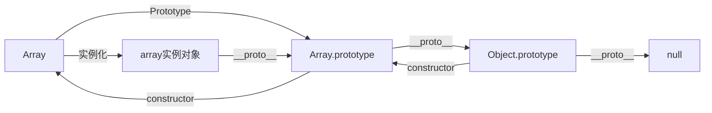

首先先来介绍一下原型和原型链

## 原型

每个函数都有一个 prototype 属性，这个属性指向函数的原型对象。原型对象中有一个 constructor 属性，指向函数本身。

## 原型链

每个对象都有一个 __proto__ 属性，指向创建它的构造函数的**原型对象**。
原型对象也是对象，也有 __proto__ 属性，指向创建它的构造函数的原型对象。这样一层一层，就形成了原型链。

## 数组的原型链

数组本身就是一个特殊的对象，所以数组的原型链和对象的原型链是一样的。

