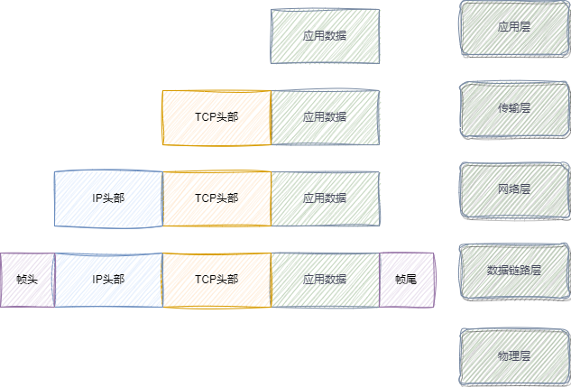

### 应用层

应用层是网络应用程序及它们的应用层协议存留的地方，例如HTTP、FTP、SMTP、DNS等。  

我们手机上的APP，电脑上的软件，都是应用层的东西。

应用层不关心数据传输的细节，传输层会帮我们处理数据传输的细节。  

应用层是工作在操作系统的用户态，传输层及以下是工作在操作系统的内核态。

### 传输层

传输层为两台主机上的应用程序提供端到端的通信，例如TCP、UDP等。

传输层有两个协议：TCP和UDP。

+ TCP提供面向连接的、可靠的数据传输服务，它能够保证数据从一端传到另一端，而且不会丢失，不会乱序，不会重复，而且还能够保证数据的顺序。

+ UDP提供无连接的、尽最大努力的数据传输服务，它不保证数据传输的可靠性，也就是说，当数据传到另一端时，我们并不能确定数据是否传输成功，也不能确定数据是否乱序，是否重复，是否丢失，也不能确定数据的顺序。

#### TCP段的由来
当应用层需要传递的数据非常大,超过了输出层的数据包大小的时候，这时候就会把数据分成多个小的数据包，每个小的数据包都会被封装成一个TCP段，然后再传输到传输层。  

### 网络层

应用层将数据交给传输层，传输层只是为应用层提供了端到端的通信，但是传输层并不知道数据是如何从一端传到另一端的，这就需要网络层来帮助传输层完成这个工作。

网络层使用协议：IP协议。  
+ IP协议定义了一种寻址方式，可以借助子网掩码就可以计算出网络号和主机号。
  在寻址过程中，一般都是先匹配网络号，再匹配主机号。
  + IPV4：32位寻址方式
  + IPV6：128位寻址方式
+ IP协议还定义了一种路由选择协议，可以根据IP地址的不同，选择不同的路由，从而实现数据从一端传到另一端。  
  在实际生活，两个主机并不是直接通过一条链路相连的，而是通过一些路由器相连的，所以，当数据从一端传到另一端的时候，数据会经过很多的路由器，这就需要路由器来帮助我们选择路由，从而实现数据从一端传到另一端。

> **路由器寻址工作中，就是要找到目标地址的子网，找到后进而把数据包转发给对应的网络内。**  
> **IP 协议的寻址作用是告诉我们去往下一个目的地该朝哪个方向走，路由则是根据「下一个目的地」选择路径。寻址更像在导航，路由更像在操作方向盘。**

### 链路层

链路层是网络层的下一层，它的作用是将网络层传下来的IP数据报封装成帧，然后再通过物理层进行传输。

### 物理层

物理层是整个网络模型的最底层，它的作用是将数据从一台主机传输到另一台主机，它传输的单位是比特，也就是0和1。

每一层的封装格式：  

