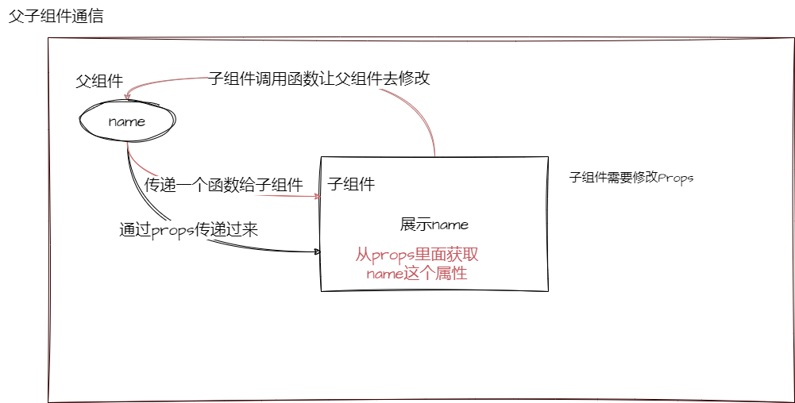
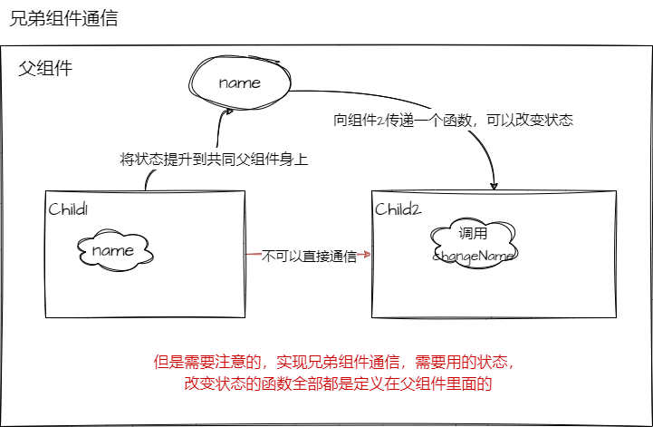
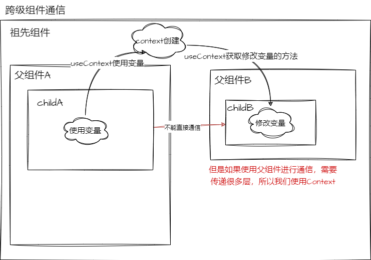

## 父子组件通信

### 父传子

使用场景: 子组件需要使用父组件的参数，这个时候我们就需要使用到父传子的方式，传递参数给子组件。**一般都是使用 Props**

```js
// 父组件
import React, { Component } from "react";

function Child(props) {
  console.log(props); // {name: "summer",children: "hello,summer"}
  return <div>{props.name}</div>;
}

export default function Parent() {
  return <Child name="summer">hello,summer</Child>;
}
```

当然我们通过`props`不仅只能获取到参数，其实对于函数组件来说，`props`就是一个对象，我们可以通过`props.children`获取到子组件(文本或者是节点)。

### 子传父

使用场景： 在子组件可能会需要修改父组件传递过来的参数，但是我们是无法直接修改 props 的，这个时候我们就需要使用到子传父的方式，通过回调函数的方式，将子组件的参数传递给父组件，然后在父组件内部修改参数。

```js
// 子组件
import React from "react";

export default function Child(props) {
  return (
    <div>
      <button onClick={() => props.changeName("summer")}>修改父组件的name</button>
    </div>
  );
}

// 父组件
import React, { Component } from "react";
import Child from "./Child";

export default function Parent() {
  const [name, setName] = useState("summer");
  const changeName = (name) => {
    setName(name);
  };
  return (
    <div>
      <Child changeName={changeName} />
      <div>{name}</div>
    </div>
  );
}
```

这时候姐可以在子组件内部通过`props.changeName`修改父组件的 name 了。

引申：**传递给事件处理函数的函数，应该是直接传递的，而不是调用**

```js
// 错误
<button onClick={props.changeName("summer")}>修改父组件的name</button>
// 这个就是直接在调用它，而不是传递给onClick
// 这样只要每次渲染子组件，都会调用changeName函数，导致无限循环

// 正确
<button onClick={() => props.changeName("summer")}>修改父组件的name</button>
```

具体参考： [响应事件](https://zh-hans.react.dev/learn/responding-to-events#adding-event-handlers)

总结来说：**事件名要么就只写时间名字，如果需要加参数(chengName(name)这种，就需要用箭头函数包裹)**

<!-- 插入图片 -->



## 兄弟组件通信

一般我们会使用**变量提升**

Q:什么是变量提升呢？
A:其实就是,如果不借助任何外力，兄弟组件是无法通信的，但是如果我们把兄弟组件的数据提升到**父组件**，那么**兄弟组件就可以通过父组件**来通信了。

```js
// 父组件
import React, { Component } from "react";
import Child1 from "./Child1";
import Child2 from "./Child2";

export default function Parent() {
  const [name, setName] = useState("summer");
  const changeName = (name) => {
    setName(name);
  };
  return (
    <div>
      <Child1 name={name} />
      <Child2 changeName={changeName} />
    </div>
  );
}

// 子组件1

import React from "react";

export default function Child1(props) {
  return <div>{props.name}</div>;
}

// 子组件2

import React from "react";

export default function Child2(props) {
  return (
    <div>
      <button onClick={() => props.changeName("alex")}>修改父组件的name</button>
    </div>
  );
}
```

在兄弟组件通信中，如果你使用的是利用变量提升的方式

- 那么你的组件的层级是不能太深的，因为如果层级太深，那么你就需要一层一层的传递参数，这样就会导致代码的可读性变差。
- 兄弟组件需要用到的参数，都需要提升到父组件，这样会导致父组件的参数变多，也会导致父组件的可读性变差。
<!-- 插入图片 -->



## 跨级组件通信

正如上面所说的，要想实现跨级的组件通信，我们就需要使用到**变量提升**的方式，将参数提升到父组件，然后再通过父组件来传递参数，但是这样会带来很多问题，比如说：**父组件的状态会非常多**以及**组件的层级会非常深**，这样会导致代码的可读性变差,这时候我们需要使用`Context`来解决这个问题。

### Context

`Context`是 React 提供的一种**跨组件传递参数**的方式，它可以让我们在不需要一层一层的传递参数的情况下，就可以实现跨组件传递参数。

`Context`的使用分为三步：

- 创建 `Context`

  ```js
  const MyContext = React.createContext();
  ```

  **如果创建的 Context,子组件获取不到，这时候需要暴露**

- 使用 `Context.Provider` 组件包裹需要传递参数的组件

  ```js
  <MyContext.Provider value={contextValue}>
    <Child />
  </MyContext.Provider>
  ```

- 在需要使用参数的组件中，使用 `Context.Consumer` 组件来获取参数

  ```js
  let contextValue = React.useContext(MyContext);
  ```



## 任意组件通信

我可以使用`redux`实现任意组件通信

引申： Redux 是什么？

